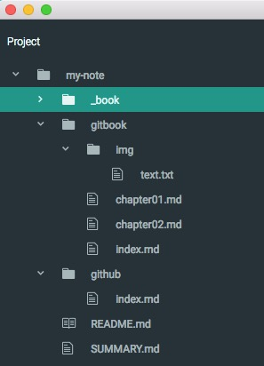

### 修改文档目录结构
- 在my-note文件夹中找到SUMMARY.md文件, 并用编辑器打开
- 根据自己文档的目录结构，按照下面的格式，编辑SUMMARY.md文件
```
  * [GitBook使用指南](README.md)
  * [第一章: GitBook初始化](gitbook/index.md)
    - [第一节: gitbook初始化](gitbook/chapter01.md)
    - [第二节: 修改文档目录结构](gitbook/chapter02.md)
  * [第二章: 备份原始md文档到github](github/index.md)
```
    * 本地目录结构如下:

    
- 编辑并保存SUMMARY.md,打开localhost:4000便看到更新后的文档啦
